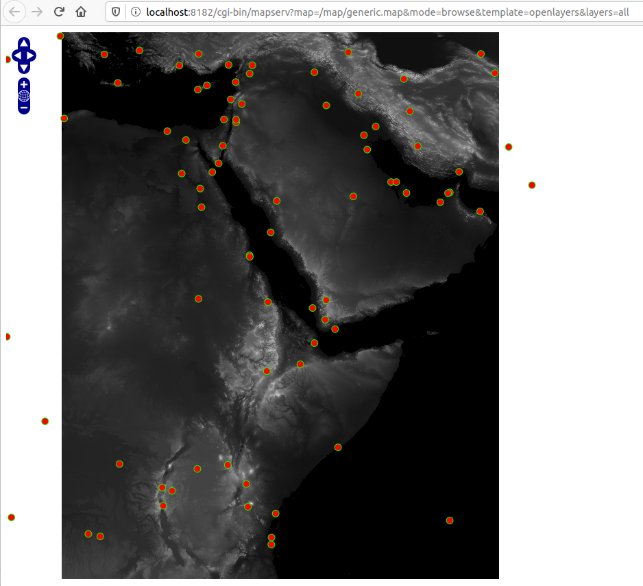

# mapserver

Docker container for Mapserver

## Instructions

## build

```docker build -t mapserver .```

## start
```docker run -d -p 8182:80 -v `pwd`/map:/map mapserver```

while the command is<br/>
`docker run -d -p [exposed port]:[internal port] -v [your-path]:[container-path] mapserver` 

To step into the container simple switch from _daemon_ mode to _interactive_ mode<br/>
```docker run -it -p 8182:80 -v `pwd`/map:/map mapserver bash```

If your mapfile consist of layer in a postgres database then you need to link the mapserver container to the postgis container.

## access

When Docker is forwarded as _localhost_ simply open the following URL:<br/> 
`http://localhost:8182/cgi-bin/mapserv`

When if you have _docker-machine_ in place check its IP with to following command and replace the _localhost_ with it.<br/>
`docker-machine ip`

To make sure the url specified above works the web browser should give a response:<br/>
 `No query information to decode. QUERY_STRING is set, but empty.`

A quick way to access the contents of your mapfile in a browser can be achived by:<br/>
`http://localhost:8182/cgi-bin/mapserv?map=/map/generic.map&mode=browse&template=openlayers&layers=all`

The displayed map should look like that:<br/>


Replace generic.map with the name of your mapserver mapfile.
